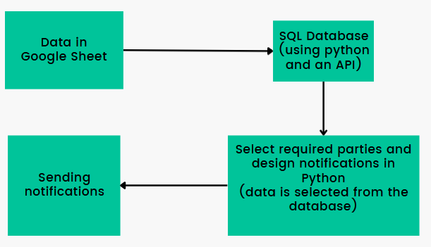
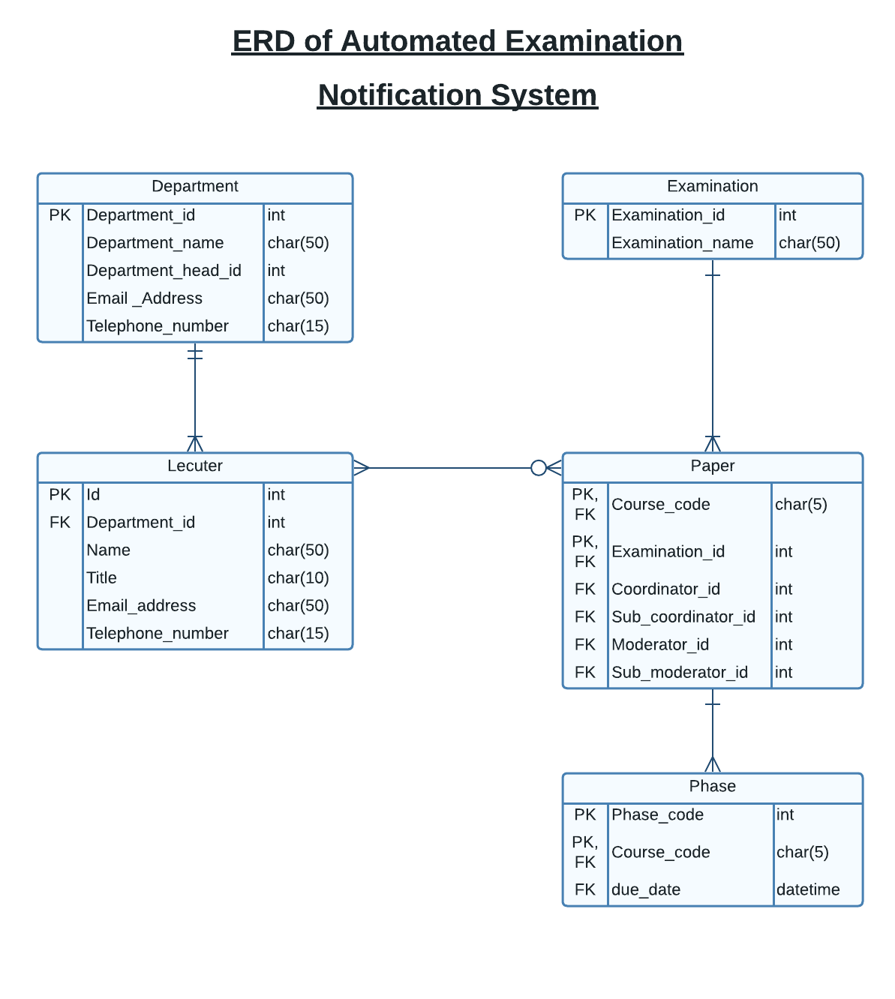

[comment]: # "This is the standard layout for the project, but you can clean this and use your own template"

# Automated Notification System for Examinations

---

# Team
-  E/18/276, Rajasooriya J.M.,[e18276@eng.pdn.ac.lk](mailto:e18276@eng.pdn.ac.lk)
-  E/18/283, Ranasinghe R.D.J.M.,[e18283@eng.pdn.ac.lk](mailto:e18283@eng.pdn.ac.lk)
-  E/18/412, De Silva M.S.G.M.,[e18412@eng.pdn.ac.lk](mailto:e18412@eng.pdn.ac.lk)

# Table of Contents
1. [Introduction](#introduction)
2. [Solution](#our-solution)
3. [Data Flow](#data-flow)
4. [ER Diagram of the Database](#er-diagram-of-the-database)
5. [Links](#links)

---

# Introduction

Normally holding examinations is not that easy. From making the paper to finalizing the marks, it has different phases that different lecturers are engaging in order to complete an examination completely.

Following are the sample procedure an examination of our department,

- Sent for Moderation
- Paper Printed and Submitted to AR
- Answer Scripts Collected
- First Marking Completed
- Second Marking Completed
- Provisional Results Released
- Final Grades Submitted

There are staff members who are incharge for each of these phases and there are deadlines for these as well.

Then those lecturers are supposed to complete these phases on or before the given deadlines. Several lecturers are engaging in these phases and also since they are tightly busy with their schedules there can be some mistakes like forgetting the deadlines. Therefore, we need to have a system to track the progress of the procedure and a reminder system to get the work done within the given time in order to finish the examinations as expected and send the results to the AR office. 

# Our solution

With this Automated Notification System that we are expecting to develop, the reminders will be sent automatically to the assigned lecturers before the deadlines. Due dates will be checked before like 3 days(this can be changed according to the department requirement). The body of the email will differ according to the different phases.

# Data Flow

 - Data is entered into a table in a Google Sheet
 - After inputting, data in the Google Sheet is sent to the Database via Sheets API
 - Required records are fetched from the Database and due dates for tasks are compared with current date in Python on a daily basis
 - If due date is close for a particular task, an email is developed (by python) as sent to required parties

# ER Diagram of the Database

# Steps of the implementation

#### STEP 01 : Get google sheet data and store in a database
- Access the google sheet with the credentials
- Call the sheets API and get the information
- Connect the database
- Insert data into the database
#### STEP 02 : Fetching data from Database
- Use SQL query for selecting the required data
- Designing the content of the amil body
#### STEP 03 : Send EMail
- Email messages can be easily sent by using python. But, there are few requirements. In order to send emails from python users, it is needed to provide "Less secure app access" permission. But, Google shutdown this feature. However, this limitation does not apply to Google Workspace or Google Cloud identity users.
#### STEP 04 : Send Discord messages
- To send discord messages two things are required.
- Token : Token is used to identify the sender of the message
- Channel ID : Channel ID is used to identify the receiver of the message
#### STEP 05 : Upload the system to a server
- We use pythonanywhere as the server of our system. Even with a free account at python anywhere we can host our python
scripts there. Also, we can schedule tasks (similar to linux crontabs) very easily. We can even create our database in pythonanywhere which helps its users to use most services at a single place.

# Google Account Setup

- [Follow this video](https://www.youtube.com/embed/txRbFpupne0){:target="_blank"}

<!-- blank line -->
<figure class="video_container">
  <iframe src="https://www.youtube.com/embed/txRbFpupne0" frameborder="0" allowfullscreen="true"> </iframe>
</figure>
<!-- blank line -->

# Installation Procedure
##### (steps are given to run the system in PythonAnywhere, after creating the keys.json file using config,ini and createJson.py)
#### Using the website created (Recommended)
- Create a task in Pythonanywhere by using fetchfromdb.py 
- Create the Database by running the createtables.sql file
- Use the website to initiate the system(create the google sheet & store the data in the database)

#### Manual running
- Create a task in Pythonanywhere by using fetchfromdb.py 
- Create the Database by running the createtables.sql file
- create the google sheet(the link is provided inside the sheetToDB.py file. If the user create any other google sheet he has to manually update all the files which uses specific data about the google sheet)
- Run sheetToDB.py file to get google sheet data into the database
 
# Testing

- [Test cases](https://docs.google.com/spreadsheets/d/1TR32hVYIOt_z9lZF45tGYNZStyhuSW5tqO0EFPY8WDc/edit?usp=sharing)
 
# Links

- [Project Repository](https://github.com/cepdnaclk/{{ page.repository-name }}){:target="_blank"}
- [Project Page](https://cepdnaclk.github.io/{{ page.repository-name}}){:target="_blank"}
- [Department of Computer Engineering](http://www.ce.pdn.ac.lk/)
- [University of Peradeniya](https://eng.pdn.ac.lk/)

[//]: # (Please refer this to learn more about Markdown syntax)
[//]: # (https://github.com/adam-p/markdown-here/wiki/Markdown-Cheatsheet)
